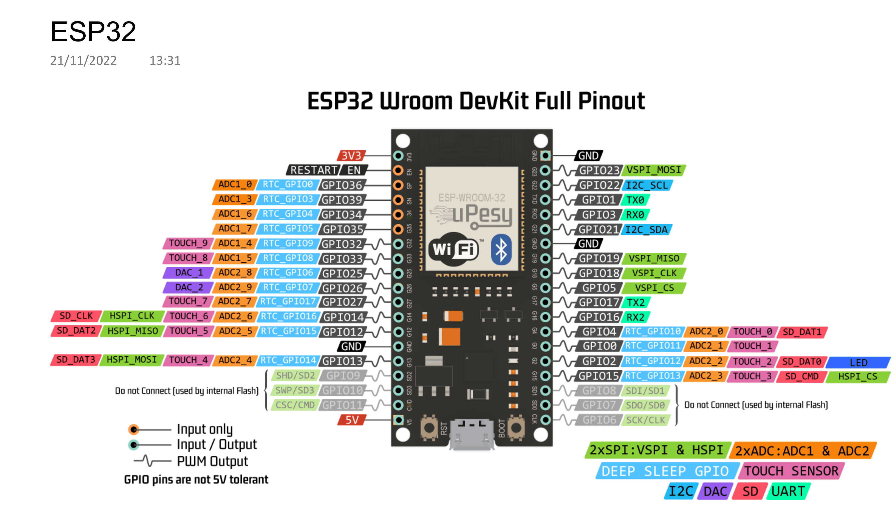
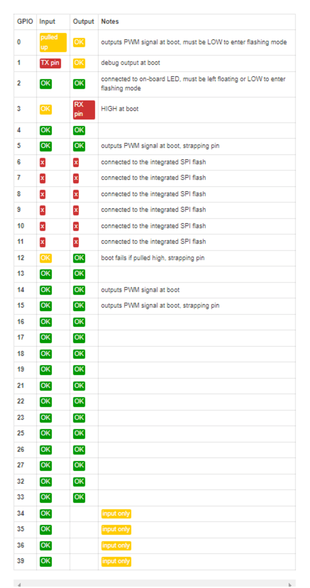

# ESP-WROOM-32u - Guia Completo de Pinout

## 📌 Visão Geral

O ESP-WROOM-32u é um módulo Wi-Fi + Bluetooth baseado no chip ESP32, com 38 pinos disponíveis. Este guia documenta todos os pinos, suas funções e restrições de uso.

---

## 🖼️ Diagramas de Pinout

### Pinout Geral do ESP32

<p align="center"><em>Figura 1: Diagrama de pinagem completo do ESP32 DevKit</em></p>



<p align="center"><strong>Fonte:</strong> Espressif, 2022.</p>

### Detalhes das Funções dos Pinos

<p align="center"><em>Figura 2: Funções detalhadas e periféricos de cada pino</em></p>



<p align="center"><strong>Fonte:</strong> Espressif, 2022.</p>

---

## 📋 Tabela Completa de Pinos

### Pinos de Alimentação

| Pino | Função | Descrição |
|------|--------|-----------|
| **3V3** | Alimentação 3.3V | Saída do regulador (máx. 500mA) |
| **GND** | Terra | Ground (múltiplos pinos) |
| **5V** | Alimentação 5V | Entrada de alimentação via USB |
| **VIN** | Alimentação Externa | 5-12V (conectado ao regulador) |
| **EN** | Enable | Reset (LOW = reset, HIGH = normal) |

### Pinos GPIO Gerais (Totalmente Seguros)

Antes da tabela, algumas definições rápidas para os acrônimos usados abaixo:

- ADC — Analog-to-Digital Converter: converte uma tensão analógica (0–3.3V) em um valor digital (normalmente 12 bits no ESP32, 0–4095). Use ADC1 para leituras confiáveis quando o Wi‑Fi estiver ativo.
- DAC — Digital-to-Analog Converter: converte um valor digital em uma tensão analógica de saída. O ESP32 possui dois canais (GPIO25 e GPIO26) com resolução de 8 bits (0–255).
- PWM — Pulse Width Modulation: técnica para gerar saídas analógicas aproximadas usando pulsos digitais; útil para controlar brilho de LED ou velocidade de motores.

| GPIO | ADC | DAC | Touch | PWM | Observações |
|------|-----|-----|-------|-----|-------------|
| **GPIO2** | - | - | Touch2 | ✅ | LED integrado em muitas placas |
| **GPIO4** | ADC2_0 | - | Touch0 | ✅ | Uso geral seguro |
| **GPIO5** | - | - | - | ✅ | SPI CS padrão |
| **GPIO13** | ADC2_4 | - | Touch4 | ✅ | Uso geral seguro |
| **GPIO14** | ADC2_6 | - | Touch6 | ✅ | Uso geral seguro |
| **GPIO16** | - | - | - | ✅ | RX2 (UART2) |
| **GPIO17** | - | - | - | ✅ | TX2 (UART2) |
| **GPIO18** | - | - | - | ✅ | SPI SCK padrão |
| **GPIO19** | - | - | - | ✅ | SPI MISO padrão |
| **GPIO21** | - | - | - | ✅ | I2C SDA padrão |
| **GPIO22** | - | - | - | ✅ | I2C SCL padrão |
| **GPIO23** | - | - | - | ✅ | SPI MOSI padrão |
| **GPIO25** | ADC2_8 | DAC1 | - | ✅ | DAC output |
| **GPIO26** | ADC2_9 | DAC2 | - | ✅ | DAC output |
| **GPIO27** | ADC2_7 | - | Touch7 | ✅ | Uso geral seguro |
| **GPIO32** | ADC1_4 | - | Touch9 | ✅ | ADC1 (sempre disponível) |
| **GPIO33** | ADC1_5 | - | Touch8 | ✅ | ADC1 (sempre disponível) |

### Pinos com Restrições (Usar com Cuidado)

| GPIO | Restrição | Detalhes |
|------|-----------|----------|
| **GPIO0** | Boot Mode | Deve estar HIGH no boot. Conectado ao botão BOOT. |
| **GPIO1** | UART0 TX | Usado para debug serial. Evite se usar Serial Monitor. |
| **GPIO3** | UART0 RX | Usado para debug serial. Evite se usar Serial Monitor. |
| **GPIO12** | Boot Voltage | Deve estar LOW no boot (define tensão flash 3.3V). |
| **GPIO15** | Boot Mode | Deve estar HIGH no boot. Saída PWM seguro após boot. |

### ⚠️ Pinos Apenas Entrada (Input Only)

| GPIO | ADC | Touch | Observações |
|------|-----|-------|-------------|
| **GPIO34** | ADC1_6 | - | Apenas INPUT (sem pull-up/down interno) |
| **GPIO35** | ADC1_7 | - | Apenas INPUT (sem pull-up/down interno) |
| **GPIO36 (VP)** | ADC1_0 | - | Apenas INPUT (sem pull-up/down interno) |
| **GPIO39 (VN)** | ADC1_3 | - | Apenas INPUT (sem pull-up/down interno) |

> **Nota**: Estes pinos não podem ser usados como saída (OUTPUT) e não têm resistores pull-up/pull-down internos.

### 🚨 Pinos Perigosos (NÃO USAR)

| GPIO | Função | Por que EVITAR |
|------|--------|----------------|
| **GPIO6** | Flash SCK | Conectado à memória flash SPI interna |
| **GPIO7** | Flash SD0 | Conectado à memória flash SPI interna |
| **GPIO8** | Flash SD1 | Conectado à memória flash SPI interna |
| **GPIO9** | Flash SD2 | Conectado à memória flash SPI interna |
| **GPIO10** | Flash SD3 | Conectado à memória flash SPI interna |
| **GPIO11** | Flash CMD | Conectado à memória flash SPI interna |

> **⚠️ CRÍTICO**: Usar estes pinos pode causar crash, corrupção de memória ou brick no ESP32!

---

## 🔌 Mapeamento de Periféricos


### SPI (Serial Peripheral Interface)

SPI é um barramento serial síncrono usado para comunicação de alta velocidade entre um mestre (por exemplo o microcontrolador) e um ou mais escravos (periféricos). Ele usa normalmente 4 linhas: SCK (clock), MOSI (dados do mestre para o escravo), MISO (dados do escravo para o mestre) e CS (Chip Select) para ativar um escravo por vez.

#### VSPI (Padrão - Recomendado)
```
GPIO23 → MOSI (Master Out Slave In)
GPIO19 → MISO (Master In Slave Out)
GPIO18 → SCK  (Clock)
GPIO5  → CS   (Chip Select)
```

**O que é CS (Chip Select)?**

CS (Chip Select), às vezes chamado SS (Slave Select), é uma linha digital usada para selecionar qual dispositivo SPI no barramento deve responder. Quando o CS de um dispositivo está em LOW ele fica ativo e responde ao mestre; quando está em HIGH ele ignora o barramento. Isso permite que vários dispositivos compartilhem MOSI/MISO/SCK enquanto cada um tem seu próprio CS.

Exemplo curto:
```cpp
digitalWrite(CS_DEVICE, LOW);  // ativa o dispositivo
SPI.transfer(0x00);           // troca de dados
digitalWrite(CS_DEVICE, HIGH); // desativa o dispositivo
```

#### HSPI (Alternativo)
```
GPIO13 → MOSI
GPIO12 → MISO
GPIO14 → SCK
GPIO15 → CS
```


### I2C (Inter-Integrated Circuit)

I2C é um barramento de dois fios (SDA para dados e SCL para clock) que permite conectar múltiplos dispositivos usando endereços. É ideal para sensores e dispositivos de baixa velocidade e facilita a conexão de vários dispositivos com apenas dois pinos.

#### I2C Padrão
```
GPIO21 → SDA (Data)
GPIO22 → SCL (Clock)
```

> **Nota**: Qualquer GPIO pode ser configurado como I2C via software, mas os pinos padrão são recomendados.

### UART (Serial Communication)

UART (Universal Asynchronous Receiver/Transmitter) é uma interface serial assíncrona ponto-a-ponto usada para comunicação direta entre dois dispositivos (por exemplo microcontrolador e computador). É o padrão para debug/console (Serial Monitor) e usa TX/RX dedicados.

#### UART0 (Serial padrão - Debug)
```
GPIO1 → TX
GPIO3 → RX
```

#### UART1 (Disponível)
```
GPIO9  → TX (⚠️ Flash - não usar)
GPIO10 → RX (⚠️ Flash - não usar)
```

#### UART2 (Recomendado para uso)
```
GPIO16 → RX
GPIO17 → TX
```

### ADC (Analog to Digital Converter)

#### ADC1 (Disponível sempre - Recomendado)
```
GPIO36 (VP)  → ADC1_0
GPIO39 (VN)  → ADC1_3
GPIO32       → ADC1_4
GPIO33       → ADC1_5
GPIO34       → ADC1_6
GPIO35       → ADC1_7
```

O que é ADC?

ADC (Analog-to-Digital Converter) converte uma tensão analógica (por exemplo saída de um sensor) em um valor digital que o microcontrolador pode processar. No ESP32 a resolução costuma ser de 12 bits (0-4095) correspondendo ao intervalo de 0 a 3.3V. Use ADC1 (pinos 32-39) para leituras confiáveis quando o Wi‑Fi estiver ativo.

Exemplo rápido:
```cpp
int raw = analogRead(32);            // valor 0-4095
float volts = raw * (3.3 / 4095.0);  // converte para tensão
```

#### ADC2 (⚠️ Não funciona quando Wi-Fi está ativo)
```
GPIO4  → ADC2_0
GPIO0  → ADC2_1
GPIO2  → ADC2_2
GPIO15 → ADC2_3
GPIO13 → ADC2_4
GPIO12 → ADC2_5
GPIO14 → ADC2_6
GPIO27 → ADC2_7
GPIO25 → ADC2_8
GPIO26 → ADC2_9
```

> **⚠️ IMPORTANTE**: ADC2 compartilha recursos com Wi-Fi. Use apenas ADC1 em projetos Wi-Fi!

### DAC (Digital to Analog Converter)

```
GPIO25 → DAC1 (Canal 1)
GPIO26 → DAC2 (Canal 2)
```

Resolução: 8 bits (0-255 = 0-3.3V)

O que é DAC?

DAC (Digital-to-Analog Converter) converte um valor digital em uma tensão analógica de saída. No ESP32 existem 2 canais (GPIO25 e GPIO26) com resolução de 8 bits (0-255) que geram tensões entre 0 e 3.3V, úteis para gerar áudio simples, sinais de referência ou controlar dispositivos analógicos.

Exemplo rápido:
```cpp
dacWrite(25, 128); // gera ~1.65V (valor médio)
```

### Touch Sensor (Capacitivo)

| GPIO | Touch | Sensibilidade |
|------|-------|---------------|
| GPIO4 | Touch0 | Alta |
| GPIO0 | Touch1 | Média |
| GPIO2 | Touch2 | Alta |
| GPIO15 | Touch3 | Média |
| GPIO13 | Touch4 | Alta |
| GPIO12 | Touch5 | Alta |
| GPIO14 | Touch6 | Alta |
| GPIO27 | Touch7 | Alta |
| GPIO33 | Touch8 | Alta |
| GPIO32 | Touch9 | Alta |

### PWM (Pulse Width Modulation)

**Todos os GPIO** podem gerar PWM, exceto:
- GPIO34, 35, 36, 39 (apenas input)
- GPIO6-11 (flash - não usar)

**Especificações PWM:**
- 16 canais independentes (0-15)
- Resolução: 1-16 bits (configurável)
- Frequência: até 40 MHz

---

## 💡 Recomendações de Uso

### ✅ Melhores Práticas

#### Para LEDs Externos
```cpp
// Pinos seguros para LEDs
GPIO2, GPIO4, GPIO5, GPIO13, GPIO14, GPIO15, 
GPIO16, GPIO17, GPIO18, GPIO19, GPIO21, GPIO22, 
GPIO23, GPIO25, GPIO26, GPIO27, GPIO32, GPIO33
```

#### Para Botões/Switches
```cpp
// Pinos com pull-up/down interno
GPIO2, GPIO4, GPIO5, GPIO12, GPIO13, GPIO14, GPIO15,
GPIO16, GPIO17, GPIO18, GPIO19, GPIO21, GPIO22, GPIO23,
GPIO25, GPIO26, GPIO27, GPIO32, GPIO33

// Apenas input (precisa resistor externo)
GPIO34, GPIO35, GPIO36, GPIO39
```

#### Para Leitura Analógica
```cpp
// Use APENAS ADC1 em projetos Wi-Fi
GPIO32, GPIO33, GPIO34, GPIO35, GPIO36, GPIO39
```

#### Para Relés e Cargas
```cpp
// Pinos com drive alto (até 40mA)
GPIO16, GPIO17, GPIO18, GPIO19, GPIO21, GPIO22, GPIO23
```

### ⚠️ O Que Evitar

#### ❌ Não Use para GPIO Geral:
- GPIO6-11: Conectados à flash interna
- GPIO1, GPIO3: Interferem com Serial Monitor
- GPIO0: Pode impedir boot se LOW
- GPIO12: Pode impedir boot se HIGH

#### ❌ Não Use ADC2 com Wi-Fi:
```cpp
// ERRADO em projetos Wi-Fi
analogRead(GPIO4);  // ADC2_0 - não funcionará com Wi-Fi ativo

// CORRETO
analogRead(GPIO32); // ADC1_4 - sempre funciona
```

#### ⚠️ Cuidado com Boot:
```cpp
// Evite pull-down nestes pinos:
GPIO0  // Boot mode
GPIO15 // Boot mode

// Evite pull-up neste pino:
GPIO12 // Boot voltage select
```

---

## 🔧 Configuração de Pinos no Arduino IDE

### Exemplo Completo
```cpp
// LEDs
const int LED_GREEN = 2;    // LED integrado
const int LED_RED = 4;      // LED externo

// Botões
const int BUTTON = 15;      // Com pull-up interno

// Sensor Analógico
const int SENSOR = 32;      // ADC1_4

// I2C (padrão)
const int SDA_PIN = 21;
const int SCL_PIN = 22;

// SPI (padrão)
const int MOSI_PIN = 23;
const int MISO_PIN = 19;
const int SCK_PIN = 18;
const int CS_PIN = 5;

void setup() {
  // Configurar saídas
  pinMode(LED_GREEN, OUTPUT);
  pinMode(LED_RED, OUTPUT);
  
  // Configurar entradas
  pinMode(BUTTON, INPUT_PULLUP);
  
  // ADC não precisa pinMode
  
  // I2C e SPI inicializam automaticamente
  Wire.begin(SDA_PIN, SCL_PIN);
  SPI.begin(SCK_PIN, MISO_PIN, MOSI_PIN, CS_PIN);
}

void loop() {
  // Ler botão
  bool buttonPressed = digitalRead(BUTTON) == LOW;
  
  // Ler sensor analógico (0-4095 com 12 bits)
  int sensorValue = analogRead(SENSOR);
  
  // Controlar LED
  digitalWrite(LED_GREEN, buttonPressed ? HIGH : LOW);
}
```

---

## 📊 Resumo Rápido

### GPIO Totalmente Seguros (19 pinos)
```
2, 4, 5, 13, 14, 15, 16, 17, 18, 19, 21, 22, 23, 25, 26, 27, 32, 33
```

### GPIO Apenas Input (4 pinos)
```
34, 35, 36, 39
```

### GPIO com Restrições (5 pinos)
```
0, 1, 3, 12, 15
```

### GPIO Proibidos (6 pinos)
```
6, 7, 8, 9, 10, 11
```

---

## 🔗 Referências

- [ESP32 Datasheet Oficial - Espressif](https://www.espressif.com/sites/default/files/documentation/esp32_datasheet_en.pdf)
- [ESP32 Technical Reference Manual](https://www.espressif.com/sites/default/files/documentation/esp32_technical_reference_manual_en.pdf)
- [Random Nerd Tutorials - ESP32 Pinout](https://randomnerdtutorials.com/esp32-pinout-reference-gpios/)
- [Last Minute Engineers - ESP32 Guide](https://lastminuteengineers.com/esp32-pinout-reference/)

---

## 📝 Notas Importantes

1. **Tensão**: ESP32 opera em **3.3V**. Não conecte sinais 5V diretamente nos GPIOs!
2. **Corrente**: Máximo **40mA** por pino, **200mA** total para todos os pinos.
3. **ADC2**: Não funciona quando Wi-Fi está ativo. Use apenas ADC1.
4. **Boot**: GPIO0, GPIO12 e GPIO15 afetam o modo de boot. Evite pull-ups/downs externos.
5. **Strapping Pins**: GPIO0, 2, 5, 12, 15 têm funções especiais no boot.

---

**Última Atualização**: 21 de Outubro de 2025 
**Versão do ESP32**: ESP-WROOM-32u  
**Framework**: Arduino Core for ESP32`