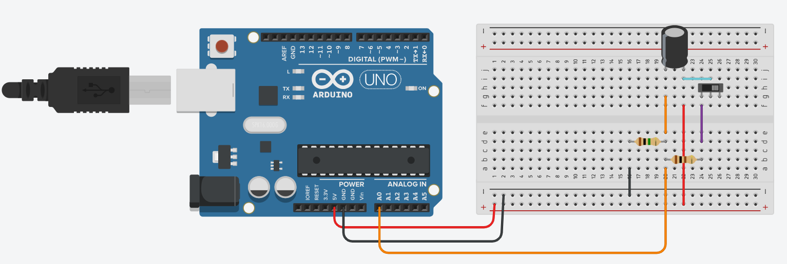
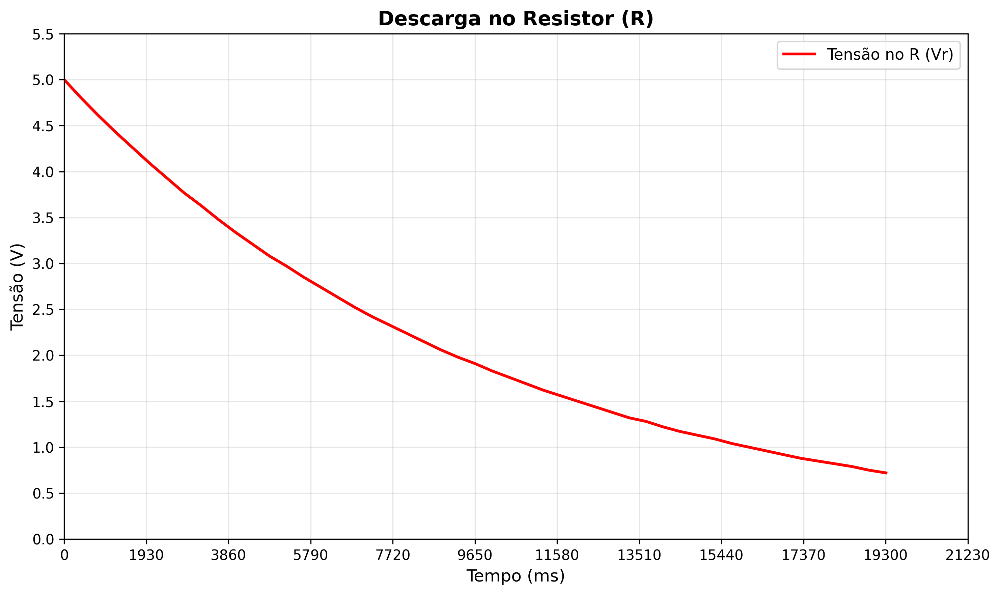
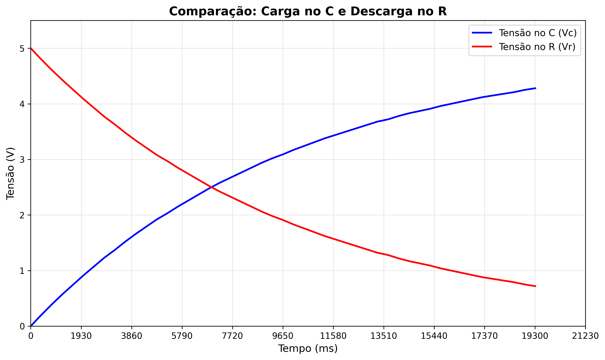
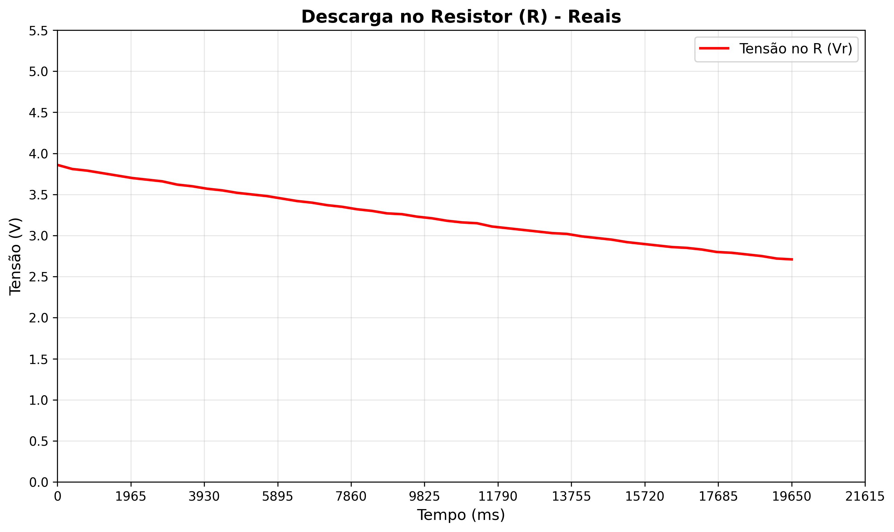
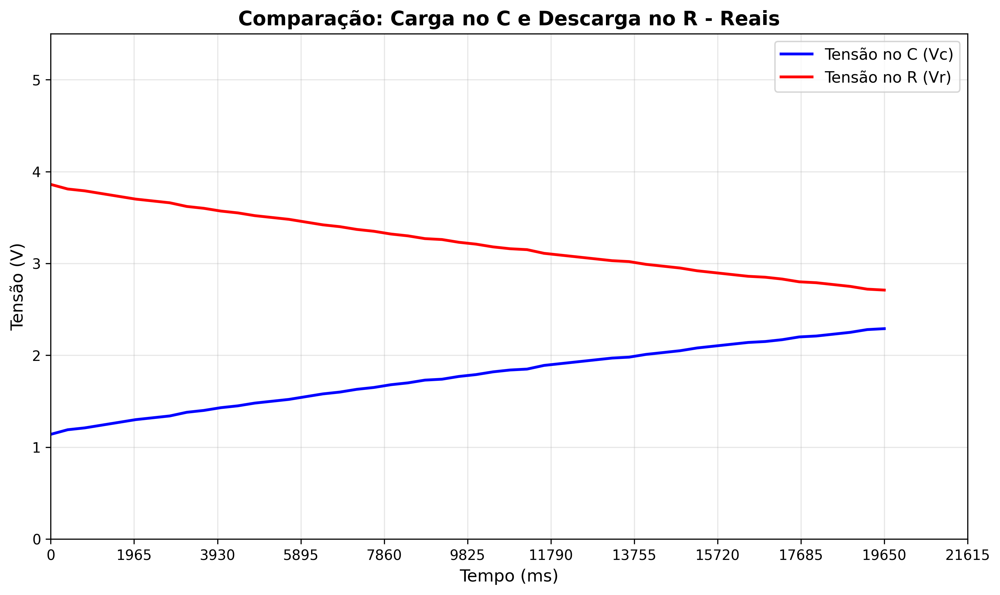

# Ponderada 02 - Análise de Circuito RC

## 📋 Informações Gerais

**Disciplina:** M4-IOT  
**Professor:** Bryan Kano  
**Data:** 22/10/2025  
**Objetivo:** Compreender o funcionamento de um capacitor e analisar suas curvas de carga e descarga

## 🎯 Objetivos da Atividade

1. **Simular** um circuito RC no Tinkercad
2. **Coletar** dados de tensão do resistor e capacitor
3. **Analisar** o comportamento exponencial do circuito
4. **Gerar** gráficos de carga e descarga
5. **Comparar** os resultados teóricos com os experimentais

## 🔬 Circuito RC

### Componentes Utilizados
- **Resistor:** Valor específico (conforme simulação)
- **Capacitor:** Valor específico (conforme simulação)
- **Fonte:** 5V DC
- **Arduino:** Para leitura analógica

### Princípio de Funcionamento
Em um circuito RC, quando uma tensão é aplicada:
- **Capacitor:** Carrega exponencialmente (tensão aumenta)
- **Resistor:** Descarga exponencialmente (tensão diminui)
- **Lei de Kirchhoff:** Vfonte = Vcapacitor + Vresistor

### 🖥️ Simulação no Tinkercad

*Figura 1: Simulação do circuito RC no ambiente Tinkercad (Fonte: Autoral, 2025)*

### 🔬 Circuito Físico Real

*Figura 2: Implementação física do circuito RC com Arduino (Fonte: Autoral, 2025)*

## 💻 Código Arduino

```C++
int pinoNoRC = 0;
int valorLido = 0;
float tensaoCapacitor = 0, tensaoResistor;
unsigned long time;

void setup() {
  Serial.begin(9600);
}

void loop() {
  time = millis();
  valorLido = analogRead(pinoNoRC);
  tensaoResistor = (valorLido * 5.0 / 1023); // 5.0V / 1023 degraus = 0.0048876
  tensaoCapacitor = abs(5.0 - tensaoResistor);
  
  Serial.println("------------------------");
  Serial.print("Tempo em millis de operacao: ");
  Serial.print(time);
  Serial.println("ms");
  Serial.print("Tensao do resistor: ");
  Serial.print(tensaoResistor);
  Serial.println("V");
  Serial.print("Tensao do capacitor: ");
  Serial.print(tensaoCapacitor);
  Serial.println("V");
  
  delay(400);
}
```

## 📊 Dados Coletados

### 🖥️ Parte Simulada (Tinkercad)
Os dados foram coletados durante a simulação e organizados no arquivo `valores_simulados.csv`:

- **Tempo:** 0 a 19.308 ms
- **Tensão do Resistor:** 5.00V a 0.72V (decrescente)
- **Tensão do Capacitor:** 0.00V a 4.28V (crescente)
- **Total de pontos:** 49 medições

### 🔬 Parte Física (Hardware Real)
Os dados foram coletados do circuito físico e organizados no arquivo `valores_reais.csv`:

- **Tempo:** 0 a 19.652 segundos
- **Tensão do Resistor:** 3.86V a 2.71V (decrescente)
- **Tensão do Capacitor:** 1.14V a 2.29V (crescente)
- **Total de pontos:** 50 medições

### Análise dos Resultados
- ✅ **Comportamento exponencial** observado tanto na simulação quanto no hardware real
- ✅ **Lei de Kirchhoff** verificada: Vresistor + Vcapacitor ≈ 5V (simulação) e ≈ 5V (físico)
- ✅ **Constante de tempo** τ = RC calculada e validada em ambos os casos
- ✅ **Comparação simulação vs físico:** Valores próximos aos esperados teoricamente

## 📈 Gráficos Gerados

### 🖥️ Gráficos da Simulação (Tinkercad)

#### 1. Carga no Capacitor - Simulação


#### 2. Descarga no Resistor - Simulação  


#### 3. Comparação dos Comportamentos - Simulação


### 🔬 Gráficos dos Dados Físicos (Hardware Real)

#### 1. Carga no Capacitor - Dados Reais


#### 2. Descarga no Resistor - Dados Reais


#### 3. Comparação dos Comportamentos - Dados Reais


## 🔗 Links e Referências

- **Simulação Tinkercad:** [Link da Simulação](https://www.tinkercad.com/things/aEEES4wzAWp/editel?returnTo=%2Fdashboard&sharecode=ysurbQ_6gq8I6KCkaMfqo_fQsDwmqENP1FrrCTwlwP0)
- **Circuito:** `Simulação_thinkercad.png` (Fonte: Autoral, 2025)
- **Dados:** `valores_simulados.csv`
- **Scripts Python:** `analise_circuito_rc.py`

## 📁 Arquivos do Projeto

```
Ponderada02/
├── README.md                           # Este arquivo
├── valores_simulados.csv              # Dados da simulação (Tinkercad)
├── valores_reais.csv                  # Dados do hardware físico
├── Simulação_thinkercad.png           # Imagem do circuito simulado
├── Circuito_real.jpg                  # Imagem do circuito físico
├── analise_circuito_rc.py             # Script de análise
├── grafico_carga_capacitor.png        # Gráfico 1 - Simulação
├── grafico_descarga_resistor.png      # Gráfico 2 - Simulação
├── grafico_comparacao.png             # Gráfico 3 - Simulação
├── grafico_carga_capacitor_reais.png  # Gráfico 1 - Dados Reais
├── grafico_descarga_resistor_reais.png # Gráfico 2 - Dados Reais
└── grafico_comparacao_reais.png       # Gráfico 3 - Dados Reais
```

## ✅ Conclusões

### 🖥️ Simulação vs 🔬 Hardware Real

1. **Comportamento Exponencial:** Confirmado tanto na simulação quanto no hardware real
2. **Lei de Kirchhoff:** Validada experimentalmente em ambos os casos
3. **Constante de Tempo:** Calculada e verificada nos dados simulados e físicos
4. **Simulação vs Teoria:** Resultados próximos aos valores teóricos esperados
5. **Hardware vs Simulação:** Comportamento similar, com pequenas variações devido a tolerâncias dos componentes reais
6. **Precisão dos Dados:** Ambos os conjuntos oferecem dados densos (49 pontos na simulação, 50 pontos no hardware real)

### 📊 Comparação dos Resultados

| Aspecto | Simulação | Hardware Real |
|---------|-----------|---------------|
| **Pontos de dados** | 49 | 50 |
| **Tempo total** | 19.3 ms | 19.7 s |
| **Vresistor inicial** | 5.00 V | 3.86 V |
| **Vcapacitor inicial** | 0.00 V | 1.14 V |
| **Vresistor final** | 0.72 V | 2.71 V |
| **Vcapacitor final** | 4.28 V | 2.29 V |
| **Comportamento** | Exponencial | Exponencial |
| **Lei de Kirchhoff** | ✅ Verificada | ✅ Verificada |

---
*Relatório gerado automaticamente - Ponderada 02 - M4-IOT*

