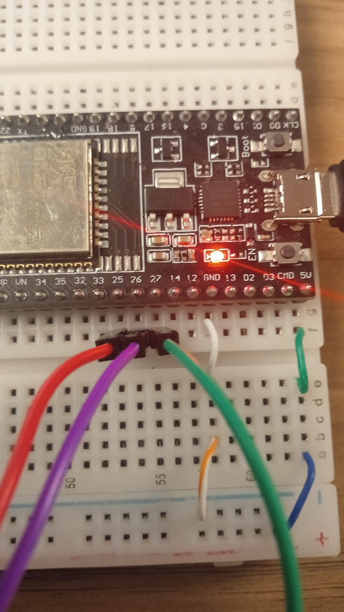
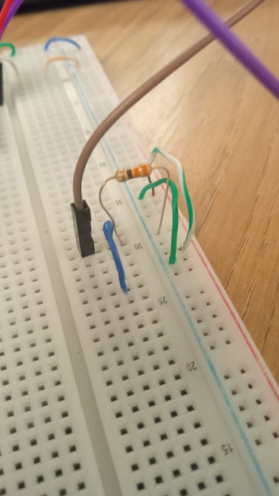
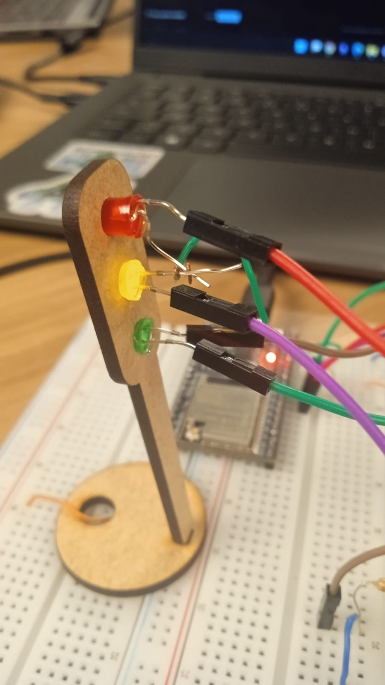

Ponderada de computação proposta pelo professor Bryan com objetivo de treinar os fundamentos de POO e ponteiros.

## Semáforo no ESP-WROOM-32U (ESP32)

Este projeto implementa um semáforo simples usando ESP32, Programação Orientada a Objetos (POO) e ponteiros. O ciclo é não bloqueante (sem `delay`), usando `millis()` para temporização.

### Contexto
Você começou a estagiar no Departamento de Engenharia de Trânsito e precisa controlar o fluxo em uma via movimentada no bairro Butantã. Seu desafio é montar e programar um semáforo que garanta a segurança de pedestres e veículos, seguindo a lógica de tempo de cada fase.

### Mapeamento de pinos
- Led verde: Pino 27
- Led amarelo: Pino 26
- Led vermelho: Pino 25

### Requisitos
- Arduino IDE (ou PlatformIO)
- Placa ESP32 instalada na IDE
- Três LEDs (verde, amarelo e vermelho) e resistores adequados (220–330 Ω)

### Ligações elétricas (Parte 1: Montagem Física)
- Anodo de cada LED no respectivo pino (`27`, `26`, `25`)
- Catodo de cada LED ao GND por meio de um resistor em série
- Organize a fiação na protoboard para facilitar a visualização.

### Tabela de componentes sugeridos
| Componente | Quantidade | Especificação |
| --- | --- | --- |
| ESP32 (ESP-WROOM-32U) | 1 | DevKit ou similar |
| LED vermelho | 1 | 5 mm (ou similar) |
| LED amarelo | 1 | 5 mm (ou similar) |
| LED verde | 1 | 5 mm (ou similar) |
| Resistores | 3 | 330 Ω, 1/4 W |
| Protoboard | 1 | 400–830 pontos |
| Jumpers | alguns | macho-macho |

### Código-fonte
O arquivo principal é `Ponderada03 - Semaforo.ino`. Ele define:
- Classe `Led`: encapsula um pino digital com métodos `begin()`, `on()` e `off()`.
- Enum `LightState`: representa os estados `Green`, `Yellow`, `Red`.
- Classe `TrafficLight`: máquina de estados não bloqueante que recebe ponteiros para `Led` e tempos de cada fase.

Os objetos `Led` e `TrafficLight` são criados dinamicamente com `new` (uso de ponteiros) e atualizados no `loop()` via `update()`.

### Temporizações do desafio (Parte 2: Programação)
- Vermelho: 6000 ms
- Verde: 4000 ms
- Amarelo: 2000 ms

O ciclo repete continuamente. Você pode alterar esses tempos no `setup()` ao instanciar `TrafficLight`.

### Como compilar e carregar
1. Abra a pasta do projeto na Arduino IDE.
2. Selecione a placa: Ferramentas → Placa → ESP32 → ESP32 Dev Module (ou a variante correspondente ao seu ESP-WROOM-32U).
3. Selecione a porta correta (COM).
4. Carregue o sketch.

### Como funciona (POO e ponteiros)
- O `TrafficLight` recebe `Led*` (ponteiros) para verde, amarelo e vermelho.
- O método `update()` troca de estado quando o tempo da fase expira, medido por `millis()`.
- Não há `delay()`, permitindo que o loop permaneça responsivo.

### Ajustes
- Pinos: altere os números passados a `Led(27)`, `Led(26)`, `Led(25)` se necessário.
- Tempos: altere os valores (em ms) ao criar `TrafficLight` no `setup()`.

### Instruções de Montagem (passo a passo)
1. Posicione a protoboard e o ESP32 na bancada, desconectado do computador.
2. Identifique os pinos do ESP32: `25` (vermelho), `26` (amarelo) e `27` (verde), além de um pino `GND`.
3. Insira os três LEDs na protoboard com distância suficiente para visualização. Observe a polaridade de cada LED:
   - Terminal longo (anodo) → vai ao pino do ESP32.
   - Terminal curto (catodo) → vai ao resistor e depois ao GND.
4. Conecte um resistor de 330 Ω em série com o catodo de cada LED até a barra de GND da protoboard.
5. Faça as ligações dos anodos aos pinos do ESP32 com jumpers:
   - LED verde → pino `27`.
   - LED amarelo → pino `26`.
   - LED vermelho → pino `25`.
6. Conecte a barra de GND da protoboard a um pino `GND` do ESP32.
7. Revise todas as conexões garantindo que cada LED tenha um resistor de 330 Ω em série no caminho até o GND.
8. Conecte o ESP32 ao computador via USB e faça o upload do código.
9. Observe o funcionamento: vermelho (6s) → verde (4s) → amarelo (2s) → repete.

### Verificação e testes
- Confirme visualmente as trocas: vermelho (6s) → verde (4s) → amarelo (2s) → repete.
- Opcional: abra o Monitor Serial (115200) para logs de inicialização.

### Entrega (Parte 3: Avaliação de Pares)
- Adicione ao repositório:
  - Vídeo demonstrativo com o autor visível: arquivo `vídeoDemonstrativo.mp4` (já incluído neste repositório) ou link externo.
  - Fotos da montagem com explicações: as imagens já estão neste repositório; referencie-as na seção de tutorial abaixo.
  - Código do semáforo (este repositório).
  - Resultados das avaliações, com nomes completos dos avaliadores.

### Tutorial de montagem com imagens
- Consulte as fotos presentes no repositório para visualizar cada etapa da montagem e a disposição dos jumpers, resistores de 330 Ω e LEDs.
- Sugestão de leitura: comece pelas imagens de visão geral, depois foque em cada LED (vermelho no pino `25`, amarelo no `26`, verde no `27`) e finalize com o close das conexões de GND através dos resistores.

#### Visão geral da montagem


#### Identificação dos pinos e ligações


#### Resistor em série (330 Ω) no catodo


#### Resistores aplicados no semáforo de madeira (ilustração)


#### Vídeo demonstrativo

O vídeo demonstrativo está disponível em: ```./vídeoDemonstrativo.mp4```

### Avaliação de Pares
- Cada atividade deve ser avaliada por pelo menos dois colegas, conforme barema do curso.
- Registre abaixo os avaliadores e suas observações/scores:
  - Avaliador 1: [Nome Completo] — [Comentários/Scores]
  - Avaliador 2: [Nome Completo] — [Comentários/Scores]

### Estrutura do repositório
```
Ponderada03 - Semaforo/
  ├─ Ponderada03 - Semaforo.ino
  ├─ Readme.md
  ├─ vídeoDemonstrativo.mp4 (opcional no git; pode ser link)
  └─ imagemDemonstrativa.mp4 (ou imagens estáticas)
```

### Observações
- Evite `delay()` para manter o loop responsivo.
- Use resistores em série com os LEDs para evitar danos.
- Ajuste as temporizações conforme necessidades do tráfego local para testes.

### Licença
Uso educacional.
